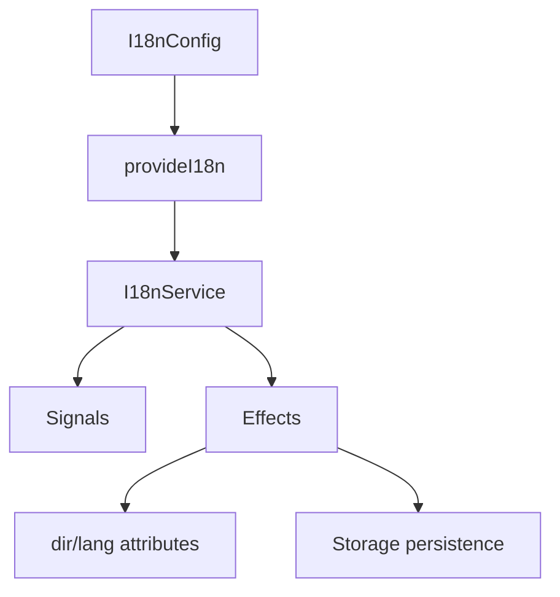

# i18n-egy

[](https://www.npmjs.com/package/i18n-egy)
[](https://github.com/abdelfattahqandil21-oss/i18n-egy/blob/main/LICENSE)
[](https://bundlephobia.com/package/i18n-egy)

Modern Angular internationalization powered by Signals. Zero runtime dependencies, fully tree-shakable, SSR-safe.

## Features

- Language switching with Signals
- Text direction management (`ltr` / `rtl`) with auto DOM sync
- Inline translation objects (no external files required)
- Persistence via localStorage, sessionStorage, or none
- Type-safe language IDs with generics
- SSR-safe with full guard coverage
- Tree-shakable and standalone
- Zero NgModules — pure functional providers
- No pipes or directives — raw signals for templates

## Why i18n-egy?

Angular's built-in i18n is powerful for large applications but requires Angular CLI build-time extraction, XLF files, and per-language builds. i18n-egy provides a lighter alternative for apps that need runtime language switching without external translation files. It is built entirely on Angular Signals — no RxJS, no directives, no pipes. Just inject, set the language, and bind signals in your templates.

## Installation

```bash
npm install i18n-egy
```

## Quick Start

```typescript
import { provideI18n, injectLanguage } from 'i18n-egy';

bootstrapApplication(App, {
  providers: [
    provideI18n({
      languages: [
        { id: 'en', nativeName: 'English', dir: 'ltr' },
        { id: 'ar', nativeName: 'العربية', dir: 'rtl' },
      ],
      defaultLanguage: 'en',
    }),
  ],
});
```

```typescript
@Component({...})
export class AppComponent {
  private i18n = injectLanguage();

  readonly currentLang = this.i18n.currentLanguage;
  readonly dir = this.i18n.dir;
  readonly isRtl = this.i18n.isRtl;
  readonly languages = this.i18n.languages;

  translate(key: string) {
    return this.i18n.translate(key, key);
  }

  setLanguage(lang: string) {
    this.i18n.setLanguage(lang);
  }
}
```

```html
<html [dir]="dir()" [lang]="currentLang()">
  <!-- ... -->
</html>
```

## Configuration

### `provideI18n(config: I18nConfig)`

| Option | Type | Default | Description |
|---|---|---|---|
| `languages` | `readonly Language<T>[]` | — | Array of supported languages (required) |
| `defaultLanguage` | `T` | — | Default language ID, must exist in `languages` (required) |
| `storageKey` | string | `'i18n-egy.language'` | Key for storage persistence |
| `storageStrategy` | `'local' \| 'session' \| 'none'` | `'local'` | Storage mechanism |
| `autoApplyDirection` | boolean | `true` | Auto-set `dir`/`lang` on `<html>` |

### Language

```typescript
interface Language<T extends string = string> {
  id: T;
  nativeName?: string;
  dir: 'ltr' | 'rtl';
}
```

## Basic Usage

### Inject I18nService

```typescript
import { injectLanguage } from 'i18n-egy';

@Component({...})
export class MyComponent {
  private i18n = injectLanguage();
}
```

### Read current language

```typescript
const lang = this.i18n.currentLanguage;       // Signal<'en' | 'ar'>
const langObj = this.i18n.currentLanguageObject; // Signal<Language>
```

### Read direction

```typescript
const dir = this.i18n.dir;    // Signal<'ltr' | 'rtl'>
const rtl = this.i18n.isRtl;  // Signal<boolean>
```

### List available languages

```typescript
const langs = this.i18n.languages; // Signal<readonly Language[]>
```

### Switch language

```typescript
this.i18n.setLanguage('ar');
this.i18n.toggle();    // toggles between first two languages
this.i18n.next();      // cycles forward
this.i18n.previous();  // cycles backward
```

### Translate

Inline translation objects — pass a map of language ID to translated string:

```typescript
@Component({...})
export class MyComponent {
  private i18n = injectLanguage();

  readonly saveLabel = computed(() =>
    this.i18n.translate({ en: 'Save', ar: 'حفظ' })
  );
}
```

Or fallback-based key translation:

```typescript
this.i18n.translate('welcome', 'Welcome');
// Returns stored value if available, otherwise 'Welcome'
```

## Architecture



## Browser Support

- Angular 20+
- Standalone applications
- SSR compatible
- Zone.js optional (Signals-based)

## API Reference

### `provideI18n<L extends string>(config: I18nConfig<L>): EnvironmentProviders`

Registers the i18n configuration. Validates at runtime — throws if `languages` is empty or `defaultLanguage` is not in the list.

### `injectLanguage(): I18nService`

Returns the singleton `I18nService` instance.

### `I18nService<L extends string>`

| Member | Type | Description |
|---|---|---|
| `currentLanguage` | `Signal<L>` | Current language ID |
| `currentLanguageObject` | `Signal<Language<L>>` | Full language object |
| `languages` | `Signal<readonly Language<L>[]>` | All configured languages |
| `languageChanged` | `Signal<L>` | Re-emits on every language change |
| `dir` | `Signal<Direction>` | Current text direction |
| `isRtl` | `Signal<boolean>` | True if current direction is RTL |
| `setLanguage(id)` | `void` | Switch to a specific language |
| `toggle()` | `void` | Toggle between first two languages |
| `next()` | `void` | Cycle to next language |
| `previous()` | `void` | Cycle to previous language |
| `translate(key, fallback?)` | `string` | Key-based translation with fallback |
| `translate(translations)` | `string` | Inline translation object |
| `getLanguage(id)` | `Language<L> \| undefined` | Look up a language by ID |

### Types

```typescript
type Direction = 'ltr' | 'rtl';
type StorageStrategy = 'local' | 'session' | 'none';
type Translation<T extends string> = Record<T, string>;
```

## License

MIT
